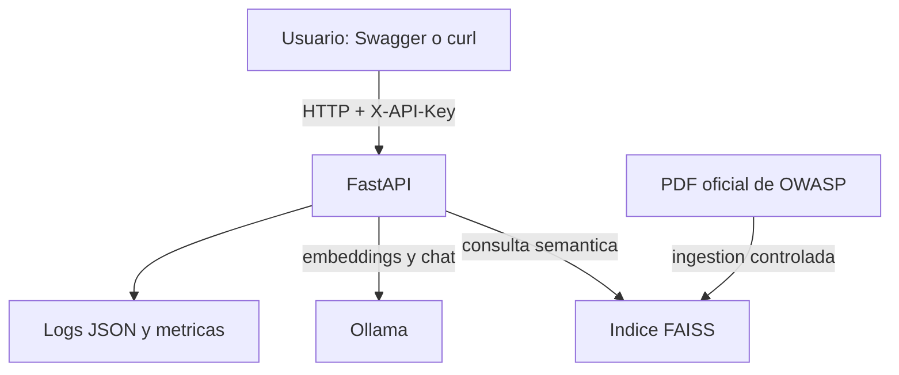

# Arquitectura y decisiones tecnicas

## Vista general

Docker Compose inicia cuatro servicios: `ollama`, `model-loader`, `ingest` y `api`. Los
modelos y el indice se conservan en volumenes de Docker. Solamente la API publica un puerto,
limitado a `127.0.0.1:8000`; Ollama permanece dentro de la red de Compose.

## Flujo de inicializacion

1. `ollama` inicia y responde a su health check.
2. `model-loader` descarga el modelo generativo y el modelo de embeddings si no existen.
3. `ingest` extrae las paginas 5 a 107, crea fragmentos y genera el indice FAISS.
4. `api` carga el indice y queda disponible para responder consultas.

El orden se expresa mediante `depends_on` y condiciones de salud o finalizacion correcta.
Una falla de descarga o ingestion impide que la API inicie con un estado inconsistente.

## Flujo de una consulta

1. FastAPI valida el JSON y normaliza la pregunta.
2. La API autentica `X-API-Key` y determina el rol.
3. El rate limiter comprueba la cuota de la credencial.
4. Qwen3 Embedding transforma la pregunta en un vector.
5. FAISS recupera los fragmentos que superan el umbral de similitud.
6. La API delimita esos fragmentos como contexto no confiable.
7. Llama 3.2 genera una respuesta acotada al contexto.
8. La salida se normaliza, se limita y se devuelve con fuentes creadas por la aplicacion.
9. La API registra estado, duracion y `request_id`, pero no el contenido ni la clave.

## Componentes

| Componente | Responsabilidad | Datos persistentes |
|---|---|---|
| FastAPI | HTTP, validacion, autenticacion, autorizacion y orquestacion RAG | Ninguno |
| Ollama | Embeddings y generacion local | Modelos en `ollama_models` |
| Ingestor | Extraccion, fragmentacion e indexacion | Indice en `rag_index` |
| FAISS | Busqueda vectorial local | Vectores y metadatos del corpus |
| GitHub Actions | Tests, calidad, auditoria y build | Ninguno |

## Decisiones y trade-offs

### Modelo local en lugar de una API externa

Evita claves de terceros, costos por consulta y envio del corpus fuera del equipo. A cambio,
la primera ejecucion descarga varios gigabytes y la latencia depende del hardware local.

### Dos tamanos de modelo

`llama3.2:3b` prioriza calidad en equipos con 16 GB de RAM o mas. `llama3.2:1b` permite
ejecutar el proyecto en equipos con menos recursos, con una perdida esperable de calidad.
La GPU es opcional; la configuracion principal funciona por CPU.

### FAISS embebido

Es suficiente para un unico PDF y reduce la cantidad de servicios. No ofrece las capacidades
multiusuario, replicacion o control de acceso de una base vectorial externa, que quedan fuera
del alcance del trabajo.

### API keys y dos roles

Una clave `reader` y otra `admin` permiten demostrar autenticacion y autorizacion sin agregar
un proveedor de identidad. No es una solucion adecuada para administrar muchos usuarios ni
para revocar credenciales individuales.

### Rate limiter en memoria

Es simple y correcto para una unica instancia local. Su estado se pierde al reiniciar y no se
comparte entre replicas; un despliegue distribuido requeriria Redis u otro almacenamiento.

### Corpus administrado

El usuario no puede subir documentos. Esto reduce en gran medida el riesgo de envenenamiento
del indice e inyeccion indirecta. La incorporacion dinamica de fuentes queda fuera de alcance.

## Limites de confianza

- Internet: se usa solamente al descargar imagenes y modelos.
- Host: contiene `.env`, Docker Desktop y los volumenes persistentes.
- Red de Compose: comunica FastAPI, Ollama e ingestion sin exponer Ollama al host.
- API: recibe entradas no confiables a traves del unico puerto publicado.
- LLM: se considera un componente no determinista y no confiable; no recibe herramientas ni
  permisos para ejecutar acciones.
