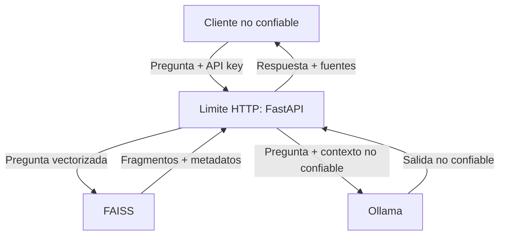

# Modelo de amenazas STRIDE

## Alcance

El modelo cubre la ejecucion local mediante Docker Compose, la API FastAPI, Ollama, el indice
FAISS, el PDF oficial, los secretos del archivo `.env` y el pipeline de GitHub Actions.
Frontend, nube, multiples usuarios reales y carga publica de documentos quedan fuera de alcance.

## Activos principales

- Claves `reader` y `admin`.
- Integridad del PDF, los fragmentos y el indice FAISS.
- Disponibilidad de CPU, GPU, memoria y espacio en disco.
- Integridad de las respuestas y de sus metadatos de fuente.
- Logs y metricas operativas.
- Codigo fuente, dependencias e imagen del contenedor.

## Flujo de datos y limites de confianza

## Analisis STRIDE

| Categoria | Amenaza | Impacto | Mitigaciones implementadas | Riesgo residual |
|---|---|---|---|---|
| Spoofing | Uso de la API sin identidad valida | Consumo no autorizado y acceso a metricas | `X-API-Key`, comparacion constante, claves distintas y minimo de 16 caracteres | Las claves estaticas pueden compartirse o filtrarse |
| Spoofing | Suplantacion del rol administrador | Exposicion de metricas | Rol derivado de la clave en el servidor; `/metrics` requiere `admin` | No existe identidad individual ni rotacion automatica |
| Tampering | Modificacion del PDF o del indice | Respuestas manipuladas | Corpus fijo, ingestion separada, volumen del indice de solo lectura en la API y atribucion del documento | Un usuario con control del host puede alterar volumenes |
| Tampering | Manipulacion de la pregunta para cambiar instrucciones | Respuestas fuera de dominio | Esquema Pydantic, normalizacion, limite de longitud y deteccion de overrides evidentes | Ningun filtro detecta todas las variantes de prompt injection |
| Repudiation | Negar una solicitud maliciosa | Dificulta auditoria y diagnostico | `request_id`, logs JSON, metodo, ruta, estado, duracion y rol | No hay identidad personal ni almacenamiento inmutable |
| Information disclosure | Claves, preguntas o respuestas en logs | Exposicion de secretos o contenido | Logs por lista permitida; nunca registran cuerpo, respuesta ni API key; errores genericos | Docker y el host deben proteger el acceso a logs y `.env` |
| Information disclosure | Extraccion del prompt del sistema o contexto | Revelacion de instrucciones o corpus | Guardrails, contexto delimitado, corpus publico, sin herramientas y respuesta limitada al dominio | El LLM puede ser inducido a revelar partes del contexto publico |
| Denial of service | Consultas repetidas o costosas | Agotamiento de CPU/GPU | Rate limiting, `Retry-After`, limites de tokens, timeout, limite de pregunta y cuota por rol | El limite es local y en memoria; no limita el tamano HTTP antes del parseo |
| Denial of service | Crecimiento indefinido de logs o procesos | Disco o procesos agotados | Rotacion de logs Docker, `pids_limit`, modelos acotados y health checks | Ollama sigue sujeto a recursos disponibles en el host |
| Elevation of privilege | Compromiso del proceso FastAPI | Acceso ampliado al contenedor | Usuario no root, imagen `slim`, filesystem de solo lectura, `cap_drop: ALL`, `no-new-privileges` y `tmpfs` | Una vulnerabilidad del runtime o Docker puede atravesar el aislamiento |
| Elevation of privilege | Usuario lector accede a funciones administrativas | Exposicion o abuso de funciones | Dependencia de autorizacion por rol y pruebas automatizadas `reader -> 403` | Solo existen dos roles globales |

## Riesgos especificos de IA

| Riesgo | Control aplicado | Evidencia verificable |
|---|---|---|
| Prompt injection directa | Normalizacion y bloqueo de patrones evidentes | `tests/test_guardrails.py` |
| Prompt injection indirecta | El contexto se etiqueta como no confiable y no puede ejecutar acciones | Prompt de sistema en `app/rag/ollama.py` |
| Envenenamiento del corpus | Un unico PDF oficial, sin endpoint de carga | `data/documents/` y Compose |
| Fuga de informacion | Corpus publico; no se envian secretos al modelo; logs sin cuerpos | Middleware y configuracion local |
| Alucinaciones | Recuperacion con umbral, temperatura baja, respuesta solo con contexto y fuentes | `app/rag/service.py` y `app/rag/ollama.py` |
| Manejo inseguro de salida | Salida limitada y normalizada; texto no ejecutable; fuentes creadas por servidor | `validate_model_output` y modelo `AskResponse` |
| Consumo sin limites | Rate limit, limites de contexto/salida y timeouts | Configuracion, `InMemoryRateLimiter` y tests |
| Agencia excesiva | El LLM no dispone de herramientas, shell, archivos ni llamadas externas | Arquitectura del servicio |

## Pruebas negativas prioritarias

1. Solicitud sin clave o con clave invalida: `401`.
2. Lector solicita `/metrics`: `403`.
3. Superar la cuota: `429` y encabezado `Retry-After`.
4. Pregunta demasiado corta, demasiado larga o con override: `422`.
5. Ollama falla: `503` sin exponer detalles internos.
6. Salida vacia, excesiva o con caracteres invisibles: rechazada antes de responder.

## Riesgo aceptado

El proyecto es educativo y de una sola instancia local. Se acepta que las API keys son
estaticas, que el rate limiter no es distribuido y que un administrador del host controla los
volumenes. Para produccion se requeririan identidad individual, TLS, un gestor de secretos,
limites en un proxy, firma del corpus, almacenamiento central de auditoria y monitoreo.

## Revision

Este modelo debe revisarse si se agregan documentos cargados por usuarios, herramientas del
LLM, exposicion en red, multiples instancias o datos privados.
